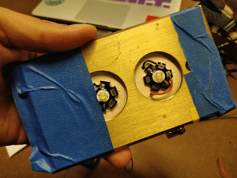

# Fabrication of a lumos! device

[Notes on the class](itp_introtofab/class01/01_class.md)

The "inspiration" for this project is my own lack of furniture. As an international student, I have to buy everything for my room, but given the cost of life of this wonderful city, I'll take any chance I get to make my own things (though, probably, they'll end up being more expensive 🤔... but anyway).

On the last month, I've come across the effect of cold light on sleep schedules and efficiency. I've set up apps like [f.lux](https://justgetflux.com/) and [OnePlus 5's](https://oneplus.net/5) Night mode. Thus, my reading light needs to be warm and not too strong.

I got a 1 watt warm LED light that fitted all the criteria. I also found a brass plate with two holes from the Junk Shelf, which along a  3 watt cold LED light that was meant for other project, was perfect to make a dual light portable flashlight. They both work with 3V, so a button cell battery was perfect not to trade power for portability. With another piece of junk wood I had the first prototype layout, which you can see in the next image.

In order to make this work, it was time to use my first power tool (at ITP, at least). THE CHOSEN ONE was the band saw. It is not my first time using a power tool, but I hadn't used one in a long time. Still, I approached it without fear, but with respect and it went perfectly. Afterwards, I had to sand it a little, drill a couple of holes and cut two canals for the cables to blend into the wood.

Now the next step was learning how to use a 3-way switch (idea given by my ITP friend, [Roland](http://ouiouioui.space/)). A short testing on a breadboard showed that on the middle pin the power (blue) would connect to any of the other two pins on the side (both of them red) and would leave both of them off in the first position. A particular challenge came when trying to solder this tiny switch. The helper arms came particularly handy, but with patience, time and some long-distance cable-tossing (out of annoyance and desperation) I actually got to do it by myself.

Now, it was time to put it all together. To see if it would work, a healthy amount of blue masking tape (best invention in the world) was used in every part of my creation. Of course, as I was mounting everything every soldered part came off at least in one place, which meant trying to do it all again while several parts were already at minimum-optimal length.

At the same time, while reviewing the prototype with Ben, he pointed out that placing the switch at the top was not a good alternative. Those switches are meant for breadboards, not final products. Also, as you turned the switch, it wobbled, so it would not last long. Following his advice, I cut a new hole, bent the pins and resoldered everything, while using a nice dose of hot glue to keep everything in it's friggin place. I also added another layer of wood to prevent the battery holder from sticking out so much. The final prototype can be seen here with the switch in the new upright position.

Finally, as every part and circuit was working, I drilled a couple of holes to keep the brass plate in place, and glued the wooden pieces together. I should really have used a brush for that, but I definitely didn't remember my school days and made a mess with it all over the place. Anyway, the device works perfectly and I'm happy with the result!

