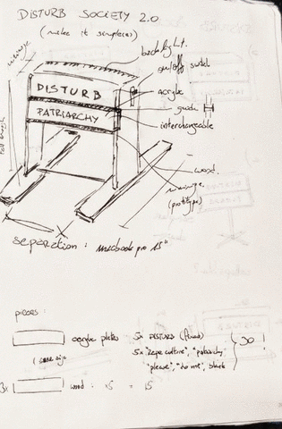
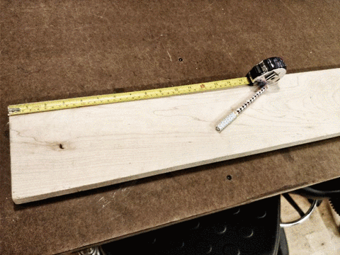
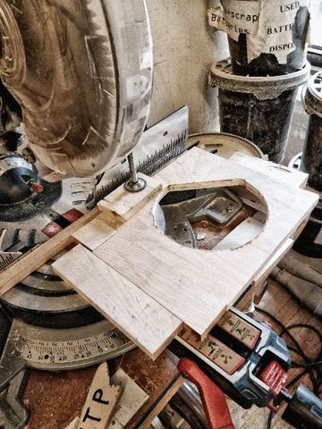
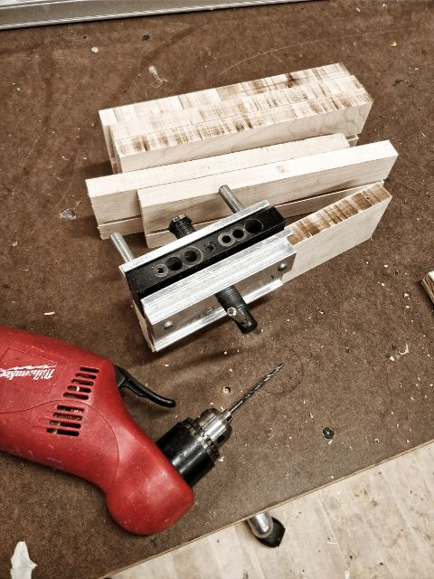
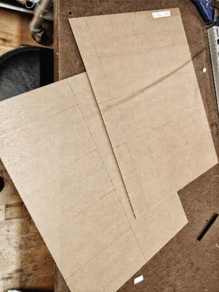
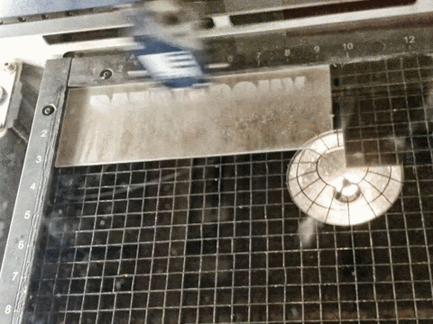
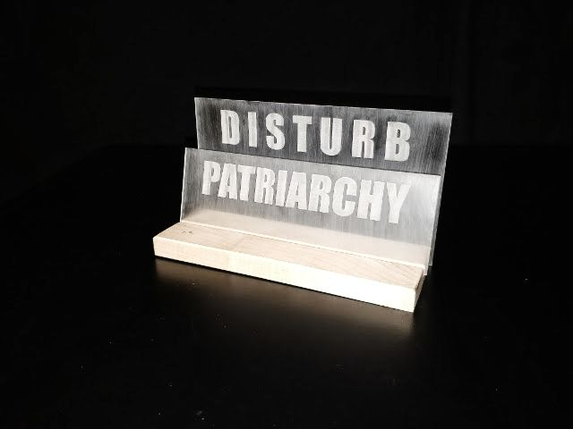

# Fabricated disturbance (of the Force, of my ideas, of my patience)

### Learning to tone it down
I had many ideas for this project. Crazy ones, at the beginning. I wanted to make shoes. No way I could make 5 pairs and 5 left shoes are just not that comfortable. Then, I had the idea for this sign, just a little bit upgraded (it was way too much). It was 1 foot tall, with backlights and at least 5 different plate options. What started as a "do/do not disturb" sign, ended being a social message against patriarchy and rape culture (if not more). Between the financial and time costs, this was not doable as well. I started "downgrading" it, but those were still too much! A rectangle with lights (those are expensive and the cool ones need 12V and that's a pain to deal with!), another tall sign with no stability, this is not working and I'm not working as a result and I already wasted the whole weekend!!!

I decided I needed to get my hands at work to make a decision. And it worked! Awesome! I needed to think in 3D and put the plaques in different planes, a fixed one on the background and a interchangeable on the front. This would make me use the miter saw and work with acrylics. And with a base heavy enough, I wouldn't need to care about the balance. Thanks to Ben's advice, I saved myself one problem (and Gosh, I had way too many) and made the background plaque taller and fixed it with screws. The words would be spray painted on sanded acrylic (so it would stick... NOT! but more on this later) and I wanted to preserve the number (why? why do I like doing this to myself?). Time to get this done (ha!).

### Trying to get it done
After getting a nice piece of hardwood I started cutting the bases. I ended up making 7, of two different widths in case I got to have a problem with the momentum. This provided the first unexpected challenge: cutting it  is not that simple, it's much harder (well, duh) than plywood and even with the miter saw it's not that easy.  Moreover, the piece was very long, and it was difficult to make the first cut on the saw. When I moved to the band saw I got worried; it was throwing dark dust and  made a weird sound, it was under a lot of stress. I asked John for help and showed me how to grease the band to reduce friction and temperature. With a lot of patience, my bases were cut.

The next challenge was making the canals for the interchangeable plaques. Back to the miter saw, spend half an hour to make a jig, only to find out that the miter couldn't do the whole thing... the bases were too long. Back to the table, adjust the letters and done, I could take out a bit more than an inch. It was almost enough... But I managed to eyeball the final part and it was decent. I ruined one, but hey, I still had six, right? Also, I already learned I could not make something as good as I wanted so, this would suffice.

For the last part of the base, I needed to make the holes for the screws. This was easy (Gosh, it was time to have an easy part!). The doweling jig was my saviour and best friend. Adjusting the holes was as easy as it can be and after an embellishing sanding, they were finally done!

### More challenges
For the acrylics, I was already running against time. Doing all those plaques would not be realistic. "Do or do not, there is no try", said Yoda. Ok, then, this time I won't. Only two different plaques (apart from the fixed "DISTURB" one): "DO NOT" and "PATRIARCHY", in order to preserve the spirit of the project. I got two 3mm thick sheets, measured the words width and height, distributed them across the sheets and started cutting. Of course, the sheets were too big for the bandsaw, so I had to do the first cuts without any guide whatsoever. Additionally, cutting acrylic is not as comfortable as wood. The dust is way thicker and feels like it could damage you. Thankfully, it is way softer, so after 30 minutes, the plaques were cut.

Now came one of the most frustrating parts of this project (it was such a pain!): getting the words on the acrylic plaques. My initial idea was to stencil them with spray paint. I knew what paint does not stick well in acrylic, but sanding it helps. I never imagined the horror of how it would look. Awful. Did not stick at all as I wanted it to. My own inexperience with spray paints and the poorly-made stencil guide (we have the WORST knifes on the shop), didn't help as well. I didn't know what to do. Time was something I absolutely did not have. Had no idea how to do it manually. Thought about getting letter stickers and forming the words by hand, until I realized I had no idea where to get those. In the end I had to resort to the one option I was avoiding, even though I knew it would give me the best result: the laser cutter. Et voila! They. Look. WONDERFUL!

Of course, there were other problems as well: Forgetting to cut that one piece and realizing after the shop closed; being careful and not drilling too big holes on the acrylic so it doesn't break, but being too conservative and the holes were too small; being *on the zone* working only to interrupt the whole flow because of other classes, etc. But in the end, I managed to get this done (woot!), and I'm pretty happy with the result.

