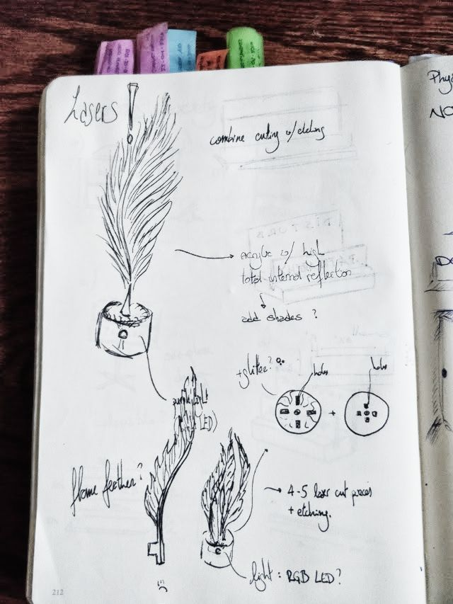
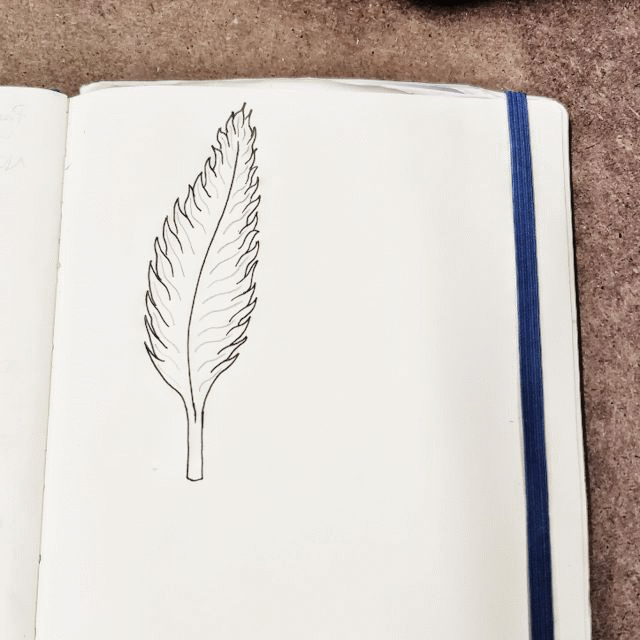
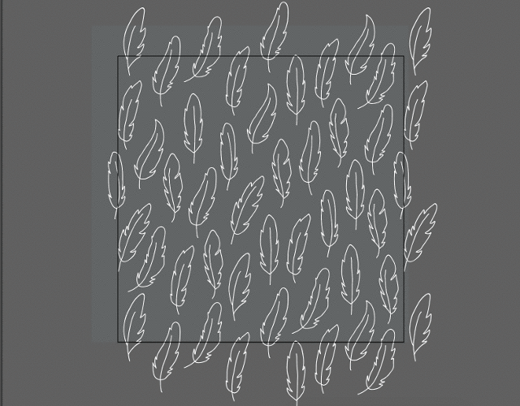
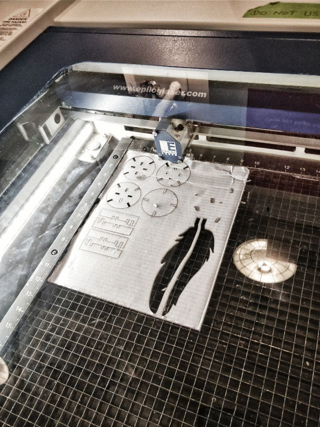
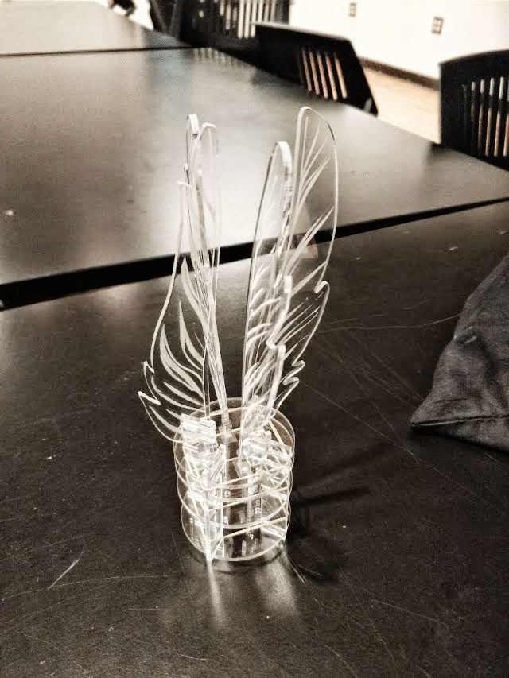
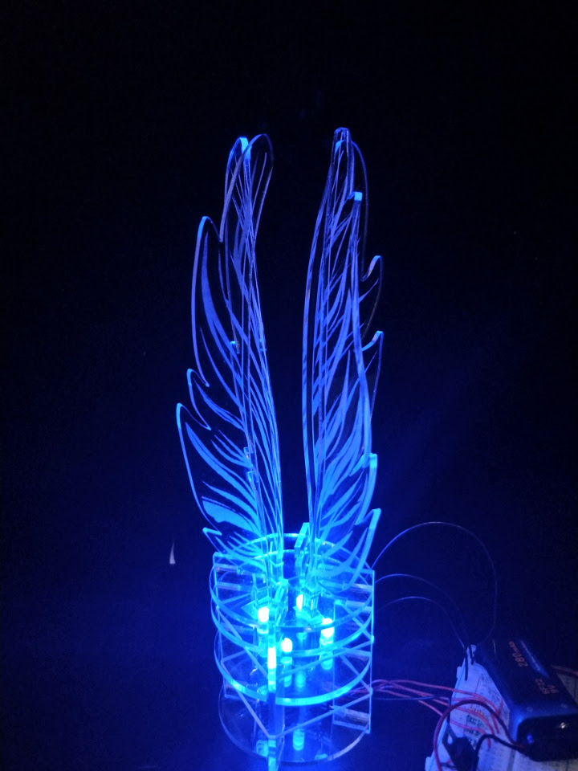

# Feather flame

For this assignment I already had a pretty good idea about what I wanted to make. I have been weirdly obsessed with feathers, and the light refracting properties from acrylic were an incredible chance to make something that suited my taste. The idea was simple: two acrylic feathers, cut in half, etched with a texture, on a base with lights underneath. Well, at least it's simpler that all my previous first ideas.

As I wanted to be the creator of everything, I started drawing the first feather. I had a pretty good idea in my mind so it was done quickly. What was not quick came after. Illustrator has an amazing option to transform images (a photographed drawing in this case) to vector-art: **Image Trace**. The problem was that it did not transform my pen lines into software lines, they were complex filled shapes. This was easily corrected with one of the presets of the same option: Line Art. Buuut, this time the result was going to need a lot of work, as the software interprets where the "center" of the trace is and completes it with some unknown procedure.

Of course, I do not have that much time to edit the drawing to get the result I wanted. I mean, come on, it's ITP and I have all those other assignments, readings and extra stuff I got myself willingly in (why nico, why?). So, it was time to go to the fabulous Internet! Google was my good friend (as always) and let me find some amazing feather vector art. For the [outlines](https://www.vecteezy.com/vector-art/144940-gray-pattern-with-feathers) and for the inner [textures](https://www.vecteezy.com/vector-art/145720-free-vintage-feathers-vectors).

After some time (but not that much) editing these resources, I came up with a pretty good result. In Illustrator, I also drew the base from the ideas I already had in my notebook. It came together amazingly fast and swift, so it was time to get the first prototype! In cardboard, of course. I have a lot for free, wouldn't use the expensive material on my first try! I loved the result.

This was amazing, it was exactly what I wanted. It had some problems, though. I wobbled a little, as the pieces were not a perfect tight fit. And I would not be able to fit a 9V battery in there, it would look horrible! But these were minor issues, so I adjusted the dimensions, moved things a bit and just went for it in acrylic.

And IT. LOOKS. BEAUTIFUL ❤️

It still wobbles a bit, which I could not fix due to an unexpected fire-alarm induced time-loss (seriously?! when everything was going SO well and I did actually have enough time?!). But well, my next problem were the lights. I had a pretty good idea of what I wanted to make for the light, but... it was not something very doable or even good looking. Previously, I had managed to build circuits on the object itself, but for this, I needed something way more precise. And I did not have a good solution for that. The only option would be to etch a board and soldering the components together, but then again... time is scarce and I definitely did not account for this one. Everything else went so well and I was failing here. Well, lesson learned. I'll just go with a breadboard this time and will finish this later with a nice soldered circuit.

