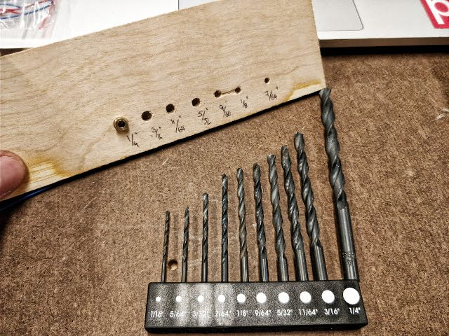
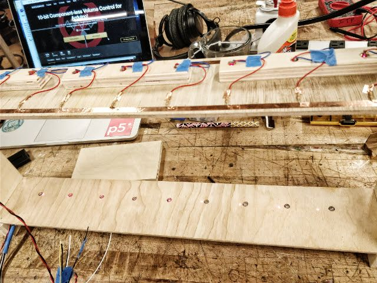

# Beautiful Ideas, Chaotic Failures

This is a story about craziness and predictability. Everything could have been avoided, but ambition got in the way.

I wanted to make a laser harp. Simple, right? Actually, no, not at all, but that made it more tempting. The concept was not that complicated: some laser diodes would be cast on phototransistors and -as they get interrupted- a corresponding tone would play. The structure was what made it all fail. I'd need to create a rectangular frame for the lasers to point directly to the sensors. This project is not that crazy, [various](http://www.instructables.com/id/Quick-Arduino-MIDI-Laser-Harp/) [versions](https://chrisballprojects.wordpress.com/2013/03/09/laser-harp-mkiii/) have been created, very well documented and with extensive instructions.

I did not have a good idea in mind on how to make the structure, or at least on how to connect the laser part with the sensor part. It was Monday and time kept running so I decided to just start making, ideas would come as my hands were making things.

I found a very nice thin piece of plywood, which was perfect for mounting the laser and sensors. Trying to rely on the laser cutter as little as possible, I cut a small piece and tested the drill bits to see how the laser diodes and the phototransistors would fit. It was a pleasant surprise to discover that the lasers fit tightly and perfectly on the 1/4" hole! Quickly, I proceeded to get both slabs, bring them to the appropriate shape and, as they were pressed together, drill the holes so I would be sure they would be aligned.

The next step was building the circuits. With the help of my newly found best friend, the copper tape, this was a piece of cake. I had to use a thicker piece of wood to make the canals for each laser, but I didn't need to have such a long starting material (this was probably one of my mistakes... a longer, thicker piece would've made the slab more resistant to bending, but might have not worked anyway). The result was pretty elegant too!

And this is where everything went to hell. I needed to mount both pieces to know if this dream was achievable (actually, to be able to proceed, it was just the next logical step). With a new piece from the fabulous Junk Shelf, I cut two pieces of wood to make the vertical stands. I cut some other smaller pieces as supports, glued them, and to avoid a possible grave and permanent mistake, used the glue gun to join the slabs with the circuits. This was the moment of truth... and despair. The lasers were not aligned with the phototransistors. And this was not a salvageable effort. I tried, but there was no way to correctly align them.

As an afterthought, I should have had a sturdy frame beforehand. This is what I always suspected, but it never occurred to me what could I use. With the frame at hand, the lasers would be mounted and the sensors placed on the exact spot the lasers pointed at.

Of course, there was no time for mourning. Thankfully, I already had some other ideas on my mind. [Aarón Montoya-Moraga](http://montoyamoraga.io/) prompted me to do some research on sound, specifically, the [Ondes Martinot](https://en.wikipedia.org/wiki/Ondes_Martenot), with examples of how [Jonny Greenwood](https://www.youtube.com/watch?v=kG8GR1msPpo) plays it (and his [other gear](http://thekingofgear.com/jonny/Keyboards#synths) as well) and [John Cage's Silence](https://www.goodreads.com/book/show/19498167-silence). This gave me the idea of randomizing sound, forgetting about scales to create sounds more freely, but most importantly, it got me thinking about making music by subtracting from sound, rather than emitting a specific pitch. So, for this new iteration of the harp-without-the-harp-itself, I'd have a bunch of LEDs showing which "thread" is playing, potentiometers to control the appearance of each pitch and a slider for the desired interaction of disabling certain sounds. For the enclosure (I still want to do it all together and have a nice musical device), I just went to the Container Store to get a wooden box. It was not the time to try yet another new thing. I got a big box and just threw everything inside in an orderly manner. It fits perfectly and has a lot of space to be comfortable.

I did not want to make a single cover and just call it a day. That would not satisfy my needs for this particular project. I knew I could change some parts, and making a new cover every time is absurd. So, I took inspiration on the modular synthesizers and decided to create several plaques with a single component (or set of components) each. With an extensive use of digital calipers, the first cardboard prototypes were perfect. And maybe too perfect, because I loved the look and feel they give! Some still needed something sturdier, like the USB mount, or the design demanded it, as the LED panel. Nevertheless, this went as smoothly as it could go, and I'm really happy with the final design.

