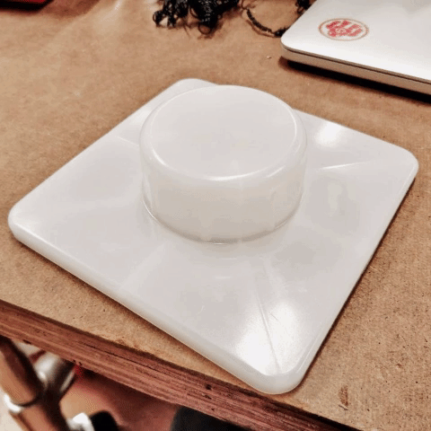

# Fragile sculpture for a fragile masculinity

Amongst the most fragile things in the universe we have glasses, grandma's centenary china and specially, masculinity. Like, [really](https://www.buzzfeed.com/lukebailey/masculinity-is-still-fracturing-all-the-time?utm_term=.keoE84Y85#.slGDZYoZx), [it](http://www.huffingtonpost.com/entry/art-masculinity-queer-man-up-exhibition_us_5874ebe1e4b02b5f858b0bb0) [is](https://medium.com/applied-intersectionality/if-men-are-so-strong-then-why-is-masculinity-so-fragile-331d0b7c5fa6) [SO](http://www.latimes.com/fashion/alltherage/la-ar-masculinity-fragile-20150923-htmlstory.html) [incredibly](https://www.indy100.com/article/men-so-fragile-7519941) [fragile](https://twitter.com/hashtag/masculinitysofragile?lang=en).
This fragility and how masculinity is constructed is what derives on the ["Triad of Violence"](http://ecbiz194.inmotionhosting.com/~micha383/wp-content/uploads/2016/03/Kaufman-1987-The-Construction-of-Masculinity-and-the-Triad-of-Mens-Violence-in-Michael-Kaufman-ed.-Beyond-Patriarchy-Essays-by-Men-on-Pleasure-Power-and-%E2%80%A6.pdf) and can be seen in the ["Seven P's of Men's Violence"](http://ecbiz194.inmotionhosting.com/~micha383/wp-content/uploads/2016/03/Kaufman-1987-The-Construction-of-Masculinity-and-the-Triad-of-Mens-Violence-in-Michael-Kaufman-ed.-Beyond-Patriarchy-Essays-by-Men-on-Pleasure-Power-and-%E2%80%A6.pdf) (both articles by [Michael Kaufman](http://michaelkaufman.com/)). So, of course, I want to make a small sculpture to reflect on this issue. <!--more-->

This is not an easy concept to show without further explanation, so I have to think carefully how to portray this idea. I want to reflect on the external aggression, which protects the internal fragility, fear, and an emotional spectrum as wide as pinhole. The idea I have is to make some masks with some of the external expressions of toxic masculinity (rage, power, virility) while hiding an inner unstable man.
This assignment requires us to use at least two materials, different from plywood and acrylic.  Thus, for the expressions I will use cork for this, as it can be laser etched (in order to have a better quality image). And I will place a hidden man made of wires, to show incompleteness and fragility.

### Light pedestal

The initial idea involved hiding the man behind a piece of fabric, which revealed it's insides only when an internal light was switched on. I found a great plastic pedestal, which worked perfectly for this week's assignment. I made a few holes (this is an extremely soft plastic, the drill bit had no trouble going through the material in an instant!), and soldered the components in no time. The expertise I've gotten really shows now.

Sadly, when I tried the light with the figure, I did not like the result with the fabric. I might need another type and look at other light projections to get better ideas on how to cast shadows. Luckily, I really liked how the figure looked by itself, and getting rid of the light gave me more freedom with the cork panel placement.

### Wiring the little fragile man

How to represent masculinity is a difficult choice. It has to be clearly a stereotypical male figure, but shouldn't have a well defined form at all. At first, I thought about wooden pieces connected by solid rigid wires. But, while thinking about sculpting, sanding and other woodworking techniques I could use, my doodles inspired me to use the solid core wires for the whole figure. By twisting, bending and making some joints, I managed to create a wire figure.

Now, this central figure couldn't stand by itself (surprise? Not at all, given what it represents) (that was actually on purpose), so it needed some central support to hold the weight and shape of the body, head and arms. Searching on the Junk Shelf I came across a metal rod with several rubber rings, which worked perfectly as bolt nuts. With a hand saw I got the piece I needed and the masculinity representation was in place.

### Cork(ing) for the first time

For the images on the cork panels, I got my resources online (best way to do it, always) (links at the end of the documentation). Between Photoshop's *posterize* tool and Illustrator's vectorization, I made four 6" x 6" panels representing outwards expressions of masculinity. Now, I hadn't thought on how to place them on the sculpture. Initially, they needed to be in such a way I could access the light switch, but now they could just cover the whole thing. The Junk Shelf helped me again with an aluminum corner frame. I cut four pieces and using the [adhesive chart](http://i1.wp.com/makezine.com/wp-content/uploads/2016/03/adhesive_chart_big.png) I came across the great news that super glue was useful (I love superglue. even if I always get some (or a lot) on my hands).

Finally, the cork may seem as a solid wall, but is quite fragile, further strengthening the idea that masculinity is a feeble social construct. It is not something someone can "have", it only exists based on the comparison of certain elements with other men. I also used it's texture to remove some pieces from the top, to create the impression that the panels are crumbling, eventually revealing the fragility they conceal.

### Links
- [Kabuki mask](https://twitter.com/kabukimaskshop)
- [Aggression fist](https://dpurb.com/2014/04/21/essay-aggression-the-biological-psychological-explanations/)
- [Gold and money](https://www.funzug.com/index.php/wallpapers/amazing-money-and-gold-wallpapers.html)
- [Iron Throne](https://ph-live-03.slatic.net/p/3/hbo-po21-game-of-thrones-iron-throne-black-1450198822-708465-1.jpg)
