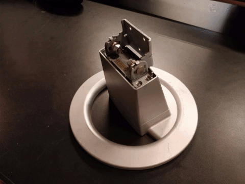
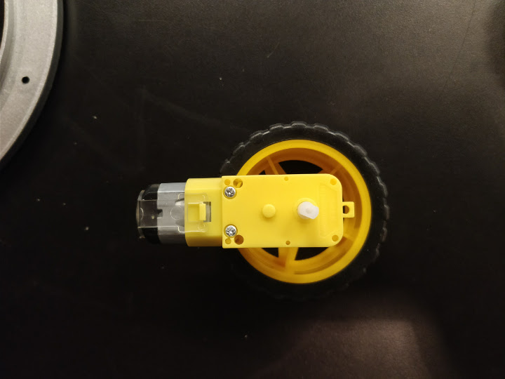
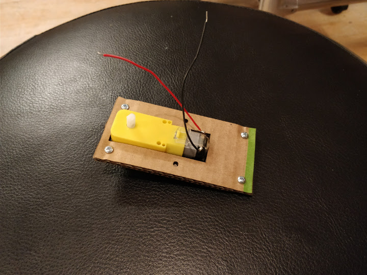
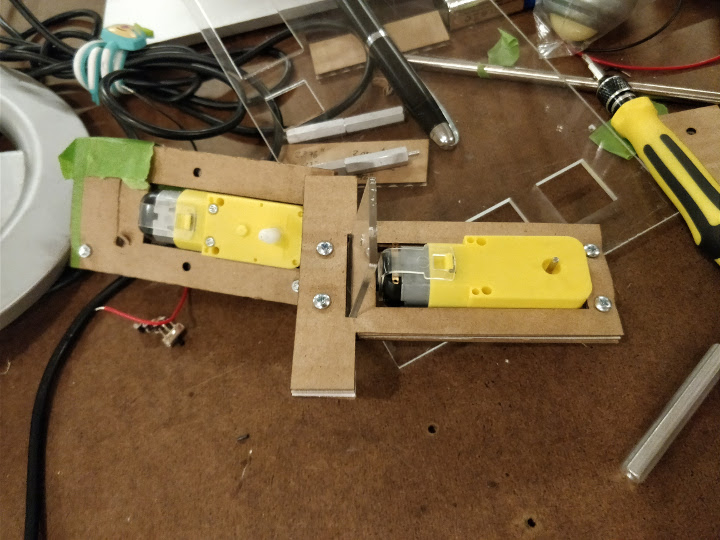
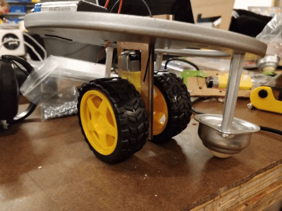
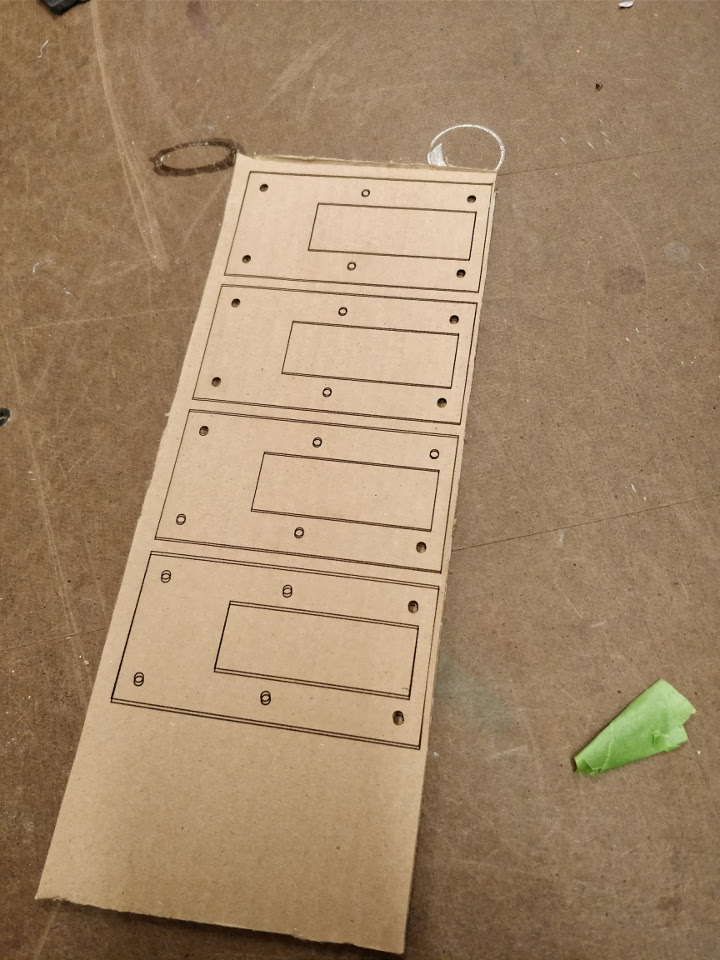
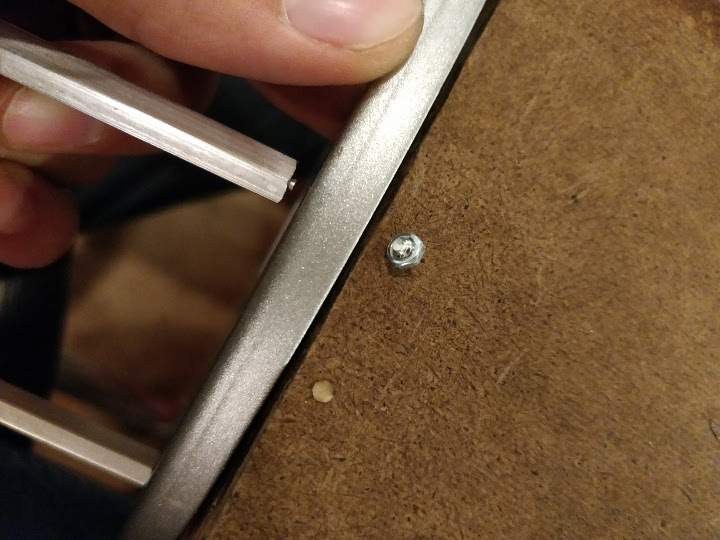
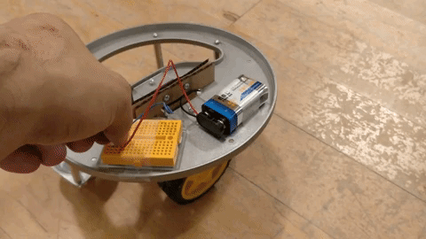

# The bones of the future (of a robot)

## Initial idea
For this assignment we had to mount a motor into something, anything! From the content of the class, I already had something in mind: I wanted my own BB8! I mean, come on, look at them, they're adorable! 😍

I looked for instructions online, because of course many people have already succeeded making their own (which only makes me want it even more). I found a [really good project](http://rcnerd.net/category/diy-bb8-building-guide/), but I realized a problem, the *Omniwheels*. From what I looked at (and what Ben told me), they're crazy expensive. Time to tone it down... again.

I wasn't ready to give up on the robot. I want it as a pet that follows me around. And while that is something I realize is extremely difficult, I thought I could set the grounds for it now. I went to the ~~inspiration~~ junk shelf and found an amazing frame for my project. This is perfect to mount my future robot in it! This first approach would be composed by two motors: a DC motor for the wheels, and a Servo for the rotation. It would also have some extra [roller balls](https://www.amazon.com/gp/product/B074DV6H83) to support it and move in any direction.

## Mounting a DC motor
As soon as I finally got my motors, I could start planning and playing. The first challenge was mounting the DC motor. The problem is that it didn't offer me any support. The holes is has are too big for #4-40 and too small for #6-32. And as I only bought small bolts, I couldn't pass them through the whole device.

Reviewing the previous classes I came up with the idea to make an enclosure **around** the device! I would make it from cardboard, so I could really press it and have it fixed. With my digital calipers (I've learned to really love them) the first attempt with the laser cutter was a total success!

## Decision time
Now I reached a critical point. I really did not know how to attach the motor to the rest of the structure. I didn't know how to proceed. Luckily, I had another seductive idea. Make a pair of jousting knights! Or better, to keep the Star Wars inspiration, make the jousting Jedi Knights on top of [Speeder Bikes](http://www.starwars.com/databank/speeder-bike). This designs are quite flat, so I would need to mount the battery in a similar way and add everything as 2D as possible. But as good as this idea seemed, I really want to make the robot! So I'll keep going this time.

Later, I came up with an idea for the connection between the base and the motor, an acrylic "plate" going through the cardboard mount for the motor. Again, this was very easily done with the calipers and the laser cutter (they should make this a set!)

## Just go with it
From all the doubts I was having, it was clear I would not be able to mount the DC motor to a Servo. Before that, I also realized I would need a circuit to reverse the polarity controlled by an Arduino, and I still haven't figured this yet. But I knew I still needed to mount the motor to the structure and I needed to test its power. I was getting doubtful it would be powerful enough to move such a heavy component.

With the drill press, I made two new holes on the structure to be able to fix the roller balls with 3" standoffs each, in order to have the sufficient height to balance the robot. I don't mind it wobbling around, at least not for now (though, as an afterthought, I could have probably adjusted the height of the cardboard piece to fit the balls with the standoffs perfectly). Everything was -finally- ready to be tested.

## Uh-oh! Problems
Before continuing, it's important to note that this experience was not free of carbs and a bunch of problems (and no, these two concepts are not unrelated at all!). The first issue was with the laser cutter. Sometimes, that damn-and-beautiful device moves the cardboard when doing the Auto-focus, so you should always secure it with paper tape.

Also, one the standoffs I used... **broke**!!! I did not expect this to happen when tightening the support of the roller balls. Luckily, I had plenty, to it was not such a problem for now, but I'm scared something might happen with them in the future. At the same time, the mounting holes on these balls were too big, but that was nothing a couple of laser-cut acrylic pieces couldn't fix.

## Testing and thoughts
Connecting power, turning on the switch, and... see for yourselves...

The motor ended up being too powerful 😂 !!! There was no way this would ever work in any way, so I'm glad I tested like this, because I could've broken something important. Sadly, I'll need to work on the coding before making this go, as I'll need to regulate the power I give to the robot and probably, I'll have to add a gyroscope to balance it (maybe this way I could get rid of the side wheels). This was a fun start and it's great to see the little robot out of control.
